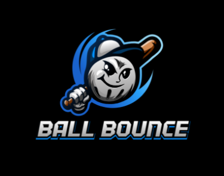
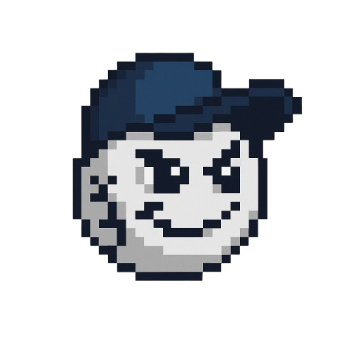
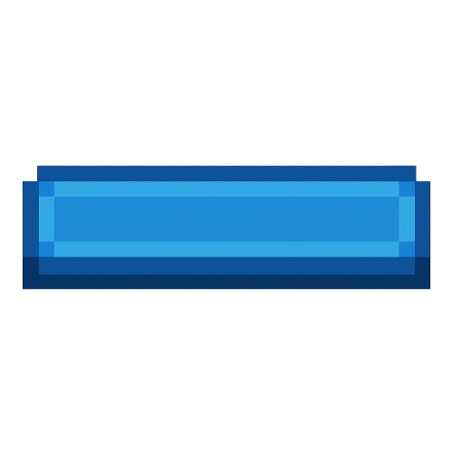
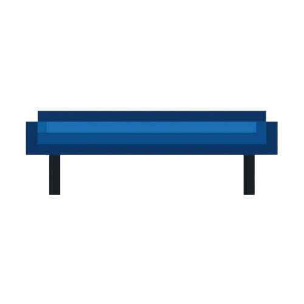
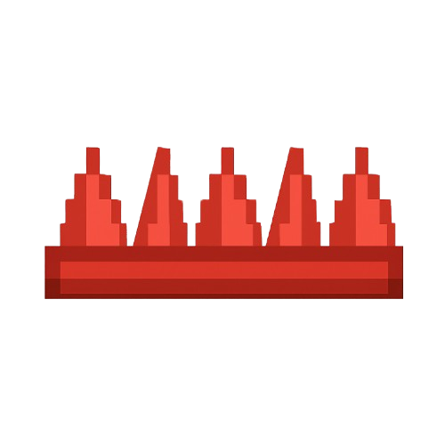

# BallBounce

BallBounce è un'applicazione mobile cross-platform sviluppata in **.NET MAUI**, che simula il rimbalzo di una pallina all'interno dello schermo. È un progetto educativo pensato per mostrare l'interazione tra fisica basilare e grafica in ambiente .NET.

### Autori

ENDRI BALLA Responsabile UX <br>
PIETRO PIGHINI Responsabile GIT <br>
MARIO LATIFI Responsabile Progettazione OOP <br>

## 🎮 Scarica l'APK

👉 [Download APK](https://www.dropbox.com/scl/fo/oh70j2cgnwby6y50hk11s/ALYyVj_-LadLZCd43Kjdlow?rlkey=uh3dieorqjwer625xj9vp973d&st=wt05pplf&dl=0)

## 🎯 Obiettivi Iniziali
- Realizzare un videogioco completo e funzionante con .NET MAUI, compatibile con dispositivi mobili (Android/iOS) e desktop.
- Applicare concetti di programmazione orientata agli oggetti, eventi e interazione touch.
- Gestire fisica di base per simulare gravità, rimbalzi e collisioni.
- Creare una UI responsive e fluida, con animazioni e feedback visivi.
- Introdurre progressione e varietà tramite livelli, nemici, bonus e ambienti diversi.
- Favorire l’esperienza utente con una curva di difficoltà ben bilanciata e un sistema di punteggi/miglioramenti.

  ---

## ✅ Obiettivi raggiunti

- ✅ Videogioco funzionante sviluppato con .NET MAUI, compatibile con Android, iOS e desktop.
- ✅ Concetti di OOP applicati con gestione eventi e interazione touch.
- ✅ Fisica di base implementata: gravità, rimbalzi e collisioni.
- ✅ UI funzionante, pronta per futuri miglioramenti.
- ✅ Generazione casuale delle mappe per aggiungere varietà.

---

## 🔧 Miglioramenti futuri

- 🔧 Migliorare l’interfaccia utente con animazioni e feedback visivi più curati.
- 🔧 Ottimizzare la fisica per una simulazione più realistica.
- 🔧 Introdurre un bilanciamento progressivo della difficoltà.
- 🔧 Espandere la generazione casuale delle mappe con ambienti e ostacoli più vari.

---

## ❌ Obiettivi non ancora raggiunti

- ❌ Aggiunta di livelli specifici con progressione.
- ❌ Inserimento di nemici o ostacoli attivi.
- ❌ Implementazione di bonus e power-up.

---


## 🛠️ Tecnologie Utilizzate

- **Linguaggio**: C#
- **Framework**: [.NET MAUI](https://learn.microsoft.com/dotnet/maui/)
- **IDE**: Visual Studio 2022+
- **Target**: Android, Windows

## 📁 Struttura del Progetto

├── BallBounce.sln # Soluzione Visual Studio<br>
├── LICENSE.txt # Licenza MIT<br>
├── .gitattributes<br>
├── .gitignore<br>
├── App.xaml, App.xaml.cs # Entry point MAUI<br>
└── MainPage.xaml, .cs # Interfaccia principale con animazioni della pallina<br>

## 📁BallBounceLibrary

Models<br>
├──Ball.cs<br>
├──Coordinates.cs<br>
├──Game.cs<br>
├──IGeneratorOfCoord.cs<br>
├──PlatformGenerator.cs<br>
├──Platforms.cs<br>
└──PowerUpGenerator.cs #WorkNotImplemented<br>

## 📁BallBounce

ViewModels<br>
├──GameViewModel.cs<br>
├──MainViewModel.cs<br>
└──RulePageViewModel.cs<br>

Views<br>
├──GamePage.xaml<br>
├──GamePage.xaml.cs<br>
├──MainPage.xaml<br>
├──MainPage.xaml.cs<br>
├──RulePage.xaml<br>
└──RulePage.xaml.cs<br>


## ▶️ Come Eseguire il Progetto in Locale

1. Clona il repository:
    ```bash
    git clone https://github.com/pietro-pighini/BallBounce.git
    ```
2. Apri `BallBounce.sln` con Visual Studio 2022 o superiore.
3. Seleziona il target Android e clicca su **Avvia (F5)**.

> ⚠️ Assicurati di avere installato il carico di lavoro **.NET MAUI** da Visual Studio Installer.

## 🖼️ Elementi del gioco

### Logo


### Ball


### Platform


### Jumping Platform


### Trap



